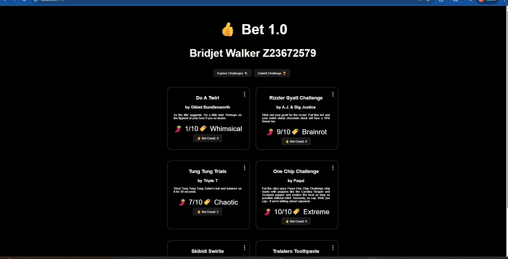

# Web Development Lab 7 - Bet

Submitted by: **Bridjet Walker (Z23672579)**

This web app: **A full-stack forum application called "Bet" where users can create, view, update, and delete challenge posts. Users can also click a Bet button to increase the bet count, and AI analyzes each challenge to assign a spiciness rating and category before saving it to the database.**

## Required Features

The following **required** functionality is completed:

- [x] The user is able to perform all four CRUD operations. The user can create a new challenge, read previous challenges, update a challenge, and delete a challenge.
- [x] All submitted challenges can be read on the homepage
- [x] A create form allows users to submit a new challenge
- [x] A challenge can be updated once it has been submitted
- [x] A challenge can be deleted once it has been submitted

## Stretch Features

The following **stretch** features are implemented:

- [x] The app is able to keep track of the bet count for each challenge
- [x] When a user clicks the Bet button, the bet count is updated in and saved to the database
- [x] The site displays the total number of users who have indicated they have accepted each challenge
- [x] AI integration automatically assigns a spiciness rating to each challenge
- [x] AI integration automatically assigns a category to each challenge
- [x] Loading screen is displayed while the AI generates post data

## Video Walkthrough

Here is a walkthrough of the implemented required features:

## Notes

One challenge I faced during this lab was connecting the React frontend to Supabase and making sure each CRUD operation worked correctly with the database instead of hardcoded data. I also had to be careful with passing props between components so that values like bet count, spiciness, and category displayed properly. Another challenge was handling the AI response, since the returned JSON needed to be cleaned and parsed before saving the generated values into Supabase.

## What I Learned

Through this lab, I learned how to build a full-stack React application using Supabase as the backend database. I got more practice with CRUD operations, handling asynchronous database requests, and updating the UI with real stored data. I also learned how to securely use environment variables for API keys and how to integrate an LLM into a web app to automatically generate extra content based on user input.